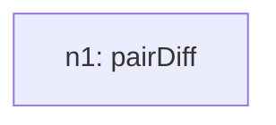
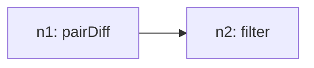

# Recursive Grammar Trace

## Inventory (S(O))
- total_tasks: 2

| taskId | op | sentenceIndex | mention | paramsHint |
| --- | --- | --- | --- | --- |
| o1 | pairDiff | 1 | Get difference between south korea and france in every year | `{"by": "Period", "seriesField": "Country", "field": "Share_of_Import_Value", "groupA": "South Korea", "groupB": "France", "signed": true, "absolute": false}` |
| o2 | filter | 2 | Filter the year with a positive value | `{"field": "Share_of_Import_Value", "operator": ">", "value": 0}` |

## Steps

### Step 1
- taskId: o1
- nodeId: n1
- op: pairDiff
- groupName: ops
- inputs: []
- scalarRefs: []

#### Inventory delta
- remaining_before_count: 2
- remaining_after_count: 1
- remaining_before: ['o1', 'o2']
- remaining_after: ['o2']

#### Tree snapshot

### Step 2
- taskId: o2
- nodeId: n2
- op: filter
- groupName: ops2
- inputs: ['n1']
- scalarRefs: []

#### Inventory delta
- remaining_before_count: 1
- remaining_after_count: 0
- remaining_before: ['o2']
- remaining_after: []

#### Tree snapshot

