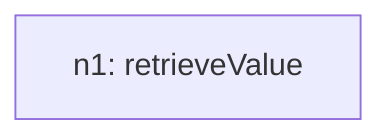
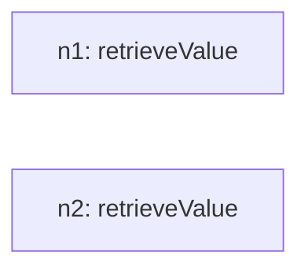
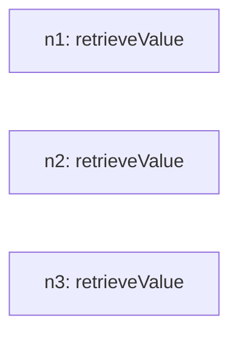
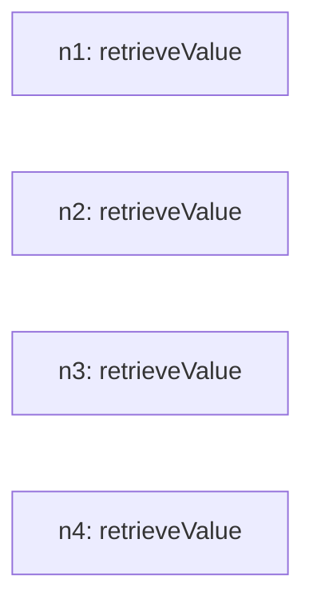
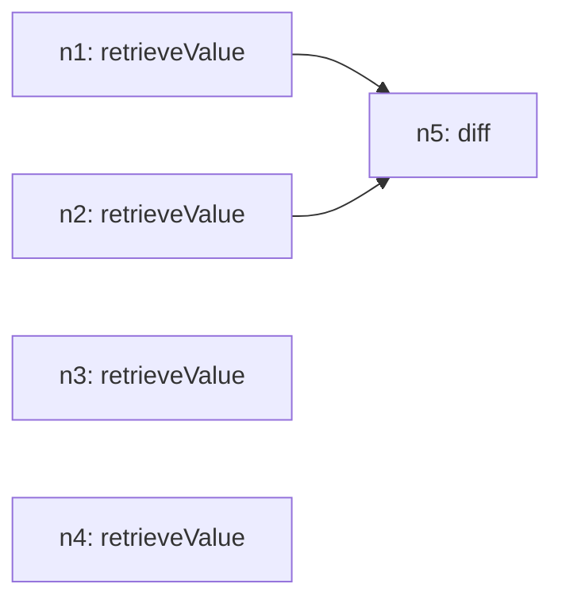
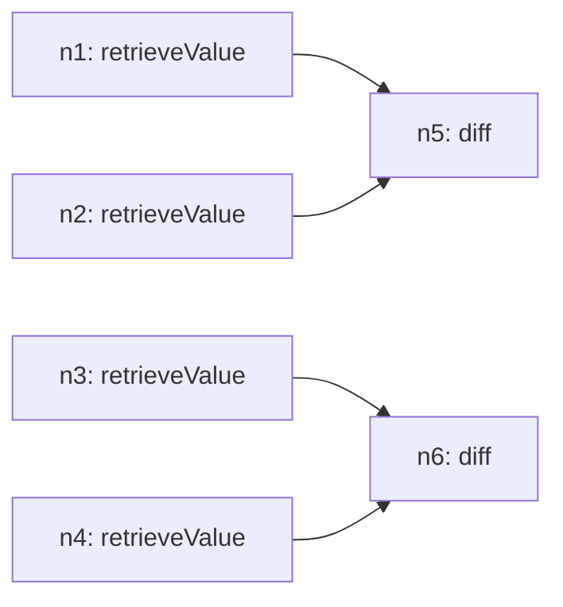
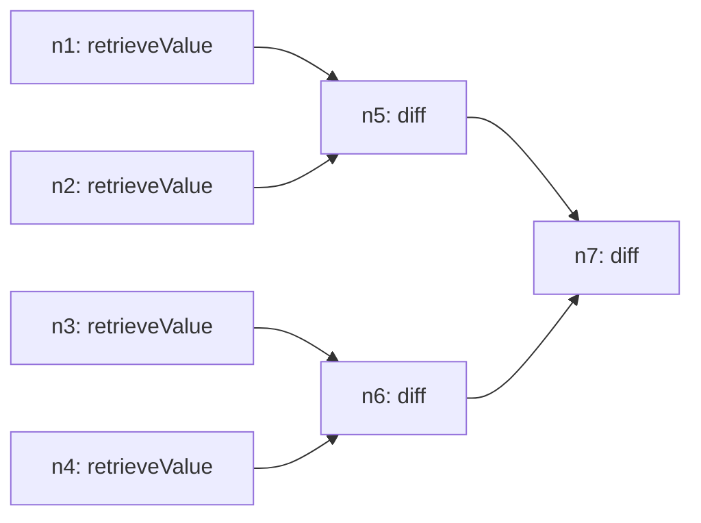

# Recursive Grammar Trace

## Inventory (S(O))
- total_tasks: 7

| taskId | op | sentenceIndex | mention | paramsHint |
| --- | --- | --- | --- | --- |
| o1 | retrieveValue | 1 | retrieve value of 2016 and 2017 | `{"field": "Year", "target": "2016"}` |
| o2 | retrieveValue | 1 | retrieve value of 2016 and 2017 | `{"field": "Year", "target": "2017"}` |
| o3 | retrieveValue | 2 | retrieve value of 2017 and 2018 | `{"field": "Year", "target": "2017"}` |
| o4 | retrieveValue | 2 | retrieve value of 2017 and 2018 | `{"field": "Year", "target": "2018"}` |
| o5 | diff | 3 | get the difference of the retrieved values | `{"targetA": "ref:n1", "targetB": "ref:n2", "signed": false}` |
| o6 | diff | 3 | get the difference of the retrieved values | `{"targetA": "ref:n3", "targetB": "ref:n4", "signed": false}` |
| o7 | diff | 3 | get the difference of the retrieved values | `{"targetA": "ref:n5", "targetB": "ref:n6", "signed": false}` |

## Steps

### Step 1
- taskId: o1
- nodeId: n1
- op: retrieveValue
- groupName: ops
- inputs: []
- scalarRefs: []

#### Inventory delta
- remaining_before_count: 7
- remaining_after_count: 6
- remaining_before: ['o1', 'o2', 'o3', 'o4', 'o5', 'o6', 'o7']
- remaining_after: ['o2', 'o3', 'o4', 'o5', 'o6', 'o7']

#### Tree snapshot

### Step 2
- taskId: o2
- nodeId: n2
- op: retrieveValue
- groupName: ops
- inputs: []
- scalarRefs: []

#### Inventory delta
- remaining_before_count: 6
- remaining_after_count: 5
- remaining_before: ['o2', 'o3', 'o4', 'o5', 'o6', 'o7']
- remaining_after: ['o3', 'o4', 'o5', 'o6', 'o7']

#### Tree snapshot

### Step 3
- taskId: o3
- nodeId: n3
- op: retrieveValue
- groupName: ops2
- inputs: []
- scalarRefs: []

#### Inventory delta
- remaining_before_count: 5
- remaining_after_count: 4
- remaining_before: ['o3', 'o4', 'o5', 'o6', 'o7']
- remaining_after: ['o4', 'o5', 'o6', 'o7']

#### Tree snapshot

### Step 4
- taskId: o4
- nodeId: n4
- op: retrieveValue
- groupName: ops2
- inputs: []
- scalarRefs: []

#### Inventory delta
- remaining_before_count: 4
- remaining_after_count: 3
- remaining_before: ['o4', 'o5', 'o6', 'o7']
- remaining_after: ['o5', 'o6', 'o7']

#### Tree snapshot

### Step 5
- taskId: o5
- nodeId: n5
- op: diff
- groupName: ops3
- inputs: ['n1', 'n2']
- scalarRefs: ['n1', 'n2']

#### Inventory delta
- remaining_before_count: 3
- remaining_after_count: 2
- remaining_before: ['o5', 'o6', 'o7']
- remaining_after: ['o6', 'o7']

#### Tree snapshot

### Step 6
- taskId: o6
- nodeId: n6
- op: diff
- groupName: ops3
- inputs: ['n3', 'n4']
- scalarRefs: ['n3', 'n4']

#### Inventory delta
- remaining_before_count: 2
- remaining_after_count: 1
- remaining_before: ['o6', 'o7']
- remaining_after: ['o7']

#### Tree snapshot

### Step 7
- taskId: o7
- nodeId: n7
- op: diff
- groupName: ops3
- inputs: ['n5', 'n6']
- scalarRefs: ['n5', 'n6']

#### Inventory delta
- remaining_before_count: 1
- remaining_after_count: 0
- remaining_before: ['o7']
- remaining_after: []

#### Tree snapshot

