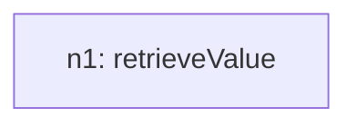
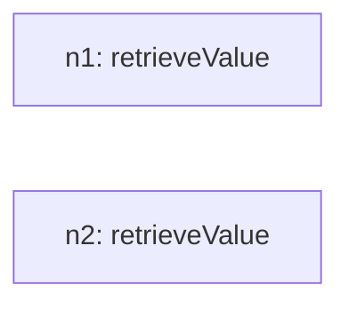

# Recursive Grammar Trace

## Inventory (S(O))
- total_tasks: 4

| taskId | op | sentenceIndex | mention | paramsHint |
| --- | --- | --- | --- | --- |
| o1 | retrieveValue | 1 | Check the value of the installed Base Millions in Tablets for 2017 | `{"field": "Year", "target": "2017", "group": "Tablets"}` |
| o2 | retrieveValue | 2 | Check Mobile PCs' Installed Base Millions value for 2022 | `{"field": "Year", "target": "2022", "group": "Mobile PCs"}` |
| o3 | findExtremum | 3 | Check the values of 1 and 2 which are greater | `{"field": "Installed_Base_Millions", "which": "max"}` |
| o4 | diff | 4 | Subtract small value from large value | `{"field": "Installed_Base_Millions", "targetA": "ref:n1", "targetB": "ref:n2", "signed": false}` |

## Steps

### Step 1
- taskId: o1
- nodeId: n1
- op: retrieveValue
- groupName: ops
- inputs: []
- scalarRefs: []

#### Inventory delta
- remaining_before_count: 4
- remaining_after_count: 3
- remaining_before: ['o1', 'o2', 'o3', 'o4']
- remaining_after: ['o2', 'o3', 'o4']

#### Tree snapshot

### Step 2
- taskId: o2
- nodeId: n2
- op: retrieveValue
- groupName: ops2
- inputs: []
- scalarRefs: []

#### Inventory delta
- remaining_before_count: 3
- remaining_after_count: 2
- remaining_before: ['o2', 'o3', 'o4']
- remaining_after: ['o3', 'o4']

#### Tree snapshot

