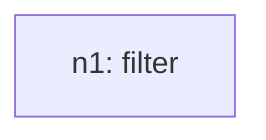
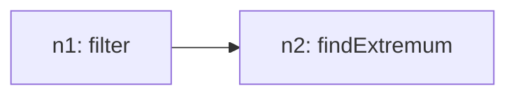
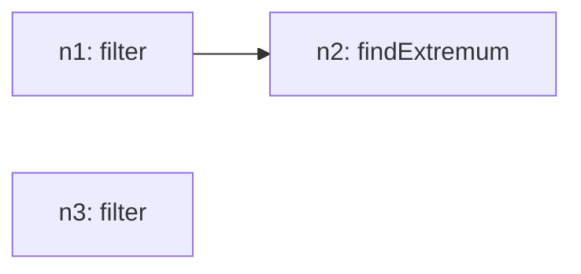
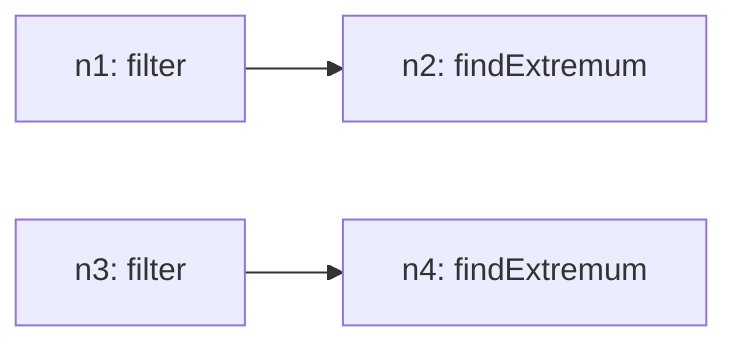
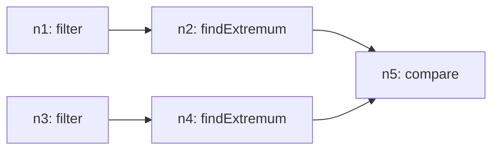
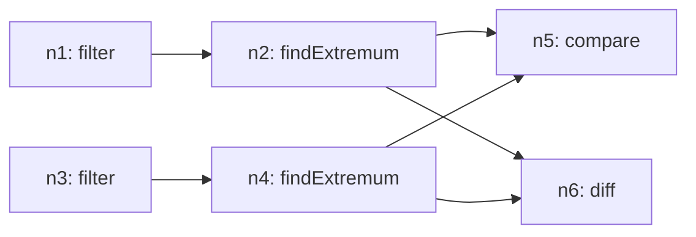

# Recursive Grammar Trace

## Inventory (S(O))
- total_tasks: 6

| taskId | op | sentenceIndex | mention | paramsHint |
| --- | --- | --- | --- | --- |
| o1 | filter | 1 | Check Scotland's Biggest Value | `{"group": "Scotland"}` |
| o2 | findExtremum | 1 | Check Scotland's Biggest Value | `{"field": "SharePercentage", "which": "max"}` |
| o3 | filter | 2 | Check the smallest value for England & Wales | `{"group": "England & Wales"}` |
| o4 | findExtremum | 2 | Check the smallest value for England & Wales | `{"field": "SharePercentage", "which": "min"}` |
| o5 | compare | 3 | Check if the value is greater than the value of number 1 or number 2 | `{"field": "SharePercentage", "targetA": "ref:n2", "targetB": "ref:n4", "which": "max"}` |
| o6 | diff | 4 | Subtract small value from large value | `{"field": "SharePercentage", "targetA": "ref:n4", "targetB": "ref:n2", "signed": false}` |

## Steps

### Step 1
- taskId: o1
- nodeId: n1
- op: filter
- groupName: ops
- inputs: []
- scalarRefs: []

#### Inventory delta
- remaining_before_count: 6
- remaining_after_count: 5
- remaining_before: ['o1', 'o2', 'o3', 'o4', 'o5', 'o6']
- remaining_after: ['o2', 'o3', 'o4', 'o5', 'o6']

#### Tree snapshot

### Step 2
- taskId: o2
- nodeId: n2
- op: findExtremum
- groupName: ops
- inputs: ['n1']
- scalarRefs: []

#### Inventory delta
- remaining_before_count: 5
- remaining_after_count: 4
- remaining_before: ['o2', 'o3', 'o4', 'o5', 'o6']
- remaining_after: ['o3', 'o4', 'o5', 'o6']

#### Tree snapshot

### Step 3
- taskId: o3
- nodeId: n3
- op: filter
- groupName: ops2
- inputs: []
- scalarRefs: []

#### Inventory delta
- remaining_before_count: 4
- remaining_after_count: 3
- remaining_before: ['o3', 'o4', 'o5', 'o6']
- remaining_after: ['o4', 'o5', 'o6']

#### Tree snapshot

### Step 4
- taskId: o4
- nodeId: n4
- op: findExtremum
- groupName: ops2
- inputs: ['n3']
- scalarRefs: []

#### Inventory delta
- remaining_before_count: 3
- remaining_after_count: 2
- remaining_before: ['o4', 'o5', 'o6']
- remaining_after: ['o5', 'o6']

#### Tree snapshot

### Step 5
- taskId: o5
- nodeId: n5
- op: compare
- groupName: ops3
- inputs: ['n2', 'n4']
- scalarRefs: ['n2', 'n4']

#### Inventory delta
- remaining_before_count: 2
- remaining_after_count: 1
- remaining_before: ['o5', 'o6']
- remaining_after: ['o6']

#### Tree snapshot

### Step 6
- taskId: o6
- nodeId: n6
- op: diff
- groupName: ops4
- inputs: ['n2', 'n4']
- scalarRefs: ['n2', 'n4']

#### Inventory delta
- remaining_before_count: 1
- remaining_after_count: 0
- remaining_before: ['o6']
- remaining_after: []

#### Tree snapshot

