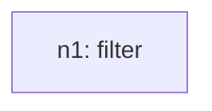
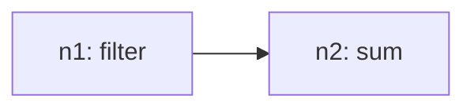
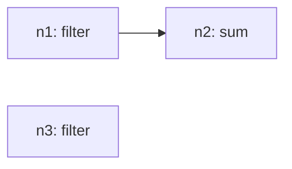
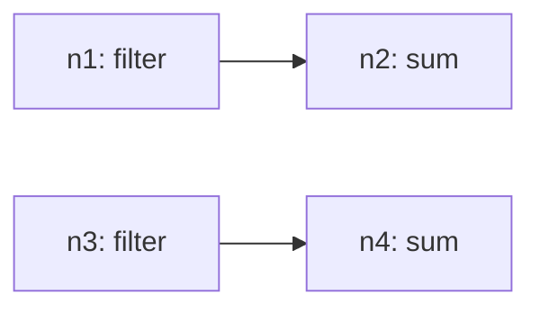
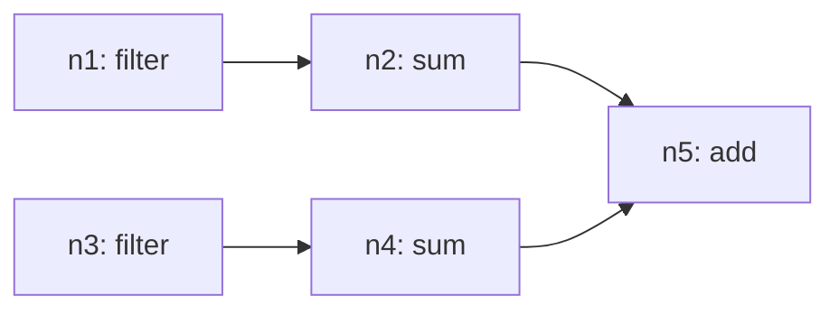

# Recursive Grammar Trace

## Inventory (S(O))
- total_tasks: 6

| taskId | op | sentenceIndex | mention | paramsHint |
| --- | --- | --- | --- | --- |
| o1 | filter | 1 | calculate the sum of each value of occasionally and infrequently | `{"field": "Frequency", "include": ["Occasionally (less than once a month)"]}` |
| o2 | sum | 1 | calculate the sum of each value of occasionally and infrequently | `{"field": "Share of respondents"}` |
| o3 | filter | 1 | calculate the sum of each value of occasionally and infrequently | `{"field": "Frequency", "include": ["Infrequently (once a year or less)"]}` |
| o4 | sum | 1 | calculate the sum of each value of occasionally and infrequently | `{"field": "Share of respondents"}` |
| o5 | add | 1 | calculate the sum of each value of occasionally and infrequently | `{"targetA": "ref:n2", "targetB": "ref:n4"}` |
| o6 | findExtremum | 2 | find the maximum | `{"field": "Share of respondents", "which": "max"}` |

## Steps

### Step 1
- taskId: o1
- nodeId: n1
- op: filter
- groupName: ops
- inputs: []
- scalarRefs: []

#### Inventory delta
- remaining_before_count: 6
- remaining_after_count: 5
- remaining_before: ['o1', 'o2', 'o3', 'o4', 'o5', 'o6']
- remaining_after: ['o2', 'o3', 'o4', 'o5', 'o6']

#### Tree snapshot

### Step 2
- taskId: o2
- nodeId: n2
- op: sum
- groupName: ops
- inputs: ['n1']
- scalarRefs: []

#### Inventory delta
- remaining_before_count: 5
- remaining_after_count: 4
- remaining_before: ['o2', 'o3', 'o4', 'o5', 'o6']
- remaining_after: ['o3', 'o4', 'o5', 'o6']

#### Tree snapshot

### Step 3
- taskId: o3
- nodeId: n3
- op: filter
- groupName: ops
- inputs: []
- scalarRefs: []

#### Inventory delta
- remaining_before_count: 4
- remaining_after_count: 3
- remaining_before: ['o3', 'o4', 'o5', 'o6']
- remaining_after: ['o4', 'o5', 'o6']

#### Tree snapshot

### Step 4
- taskId: o4
- nodeId: n4
- op: sum
- groupName: ops
- inputs: ['n3']
- scalarRefs: []

#### Inventory delta
- remaining_before_count: 3
- remaining_after_count: 2
- remaining_before: ['o4', 'o5', 'o6']
- remaining_after: ['o5', 'o6']

#### Tree snapshot

### Step 5
- taskId: o5
- nodeId: n5
- op: add
- groupName: ops
- inputs: ['n2', 'n4']
- scalarRefs: ['n2', 'n4']

#### Inventory delta
- remaining_before_count: 2
- remaining_after_count: 1
- remaining_before: ['o5', 'o6']
- remaining_after: ['o6']

#### Tree snapshot

