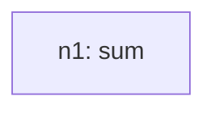
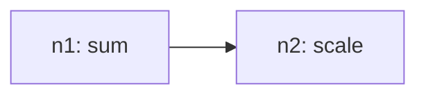
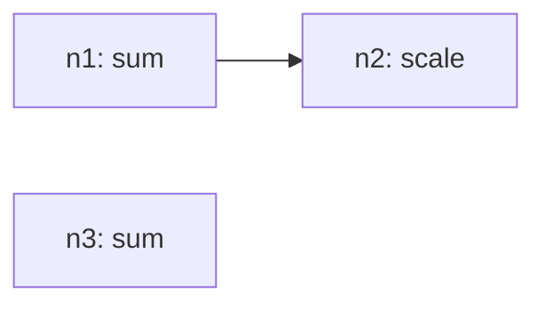
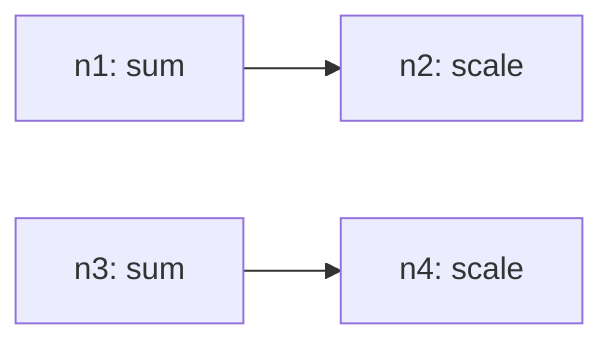
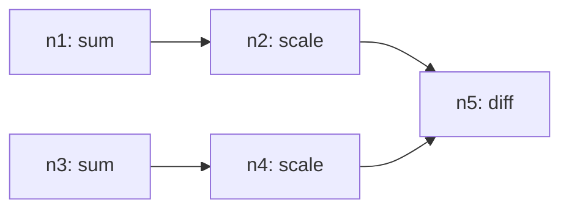

# Recursive Grammar Trace

## Inventory (S(O))
- total_tasks: 5

| taskId | op | sentenceIndex | mention | paramsHint |
| --- | --- | --- | --- | --- |
| o1 | sum | 1 | Add all the Commercial values for each year. | `{"field": "Revenue_Million_Euros", "group": "Commercial"}` |
| o2 | scale | 2 | Divide the value by six. | `{"target": "ref:n1", "factor": 0.16666666666666666}` |
| o3 | sum | 3 | Add all the values of the matchday for each year. | `{"field": "Revenue_Million_Euros", "group": "Matchday"}` |
| o4 | scale | 4 | Divide the value by six. | `{"target": "ref:n3", "factor": 0.16666666666666666}` |
| o5 | diff | 5 | Find the difference between the two computed values. | `{"field": "Revenue_Million_Euros", "targetA": "ref:n2", "targetB": "ref:n4", "signed": true}` |

## Steps

### Step 1
- taskId: o1
- nodeId: n1
- op: sum
- groupName: ops
- inputs: []
- scalarRefs: []

#### Inventory delta
- remaining_before_count: 5
- remaining_after_count: 4
- remaining_before: ['o1', 'o2', 'o3', 'o4', 'o5']
- remaining_after: ['o2', 'o3', 'o4', 'o5']

#### Tree snapshot

### Step 2
- taskId: o2
- nodeId: n2
- op: scale
- groupName: ops2
- inputs: ['n1']
- scalarRefs: ['n1']

#### Inventory delta
- remaining_before_count: 4
- remaining_after_count: 3
- remaining_before: ['o2', 'o3', 'o4', 'o5']
- remaining_after: ['o3', 'o4', 'o5']

#### Tree snapshot

### Step 3
- taskId: o3
- nodeId: n3
- op: sum
- groupName: ops3
- inputs: []
- scalarRefs: []

#### Inventory delta
- remaining_before_count: 3
- remaining_after_count: 2
- remaining_before: ['o3', 'o4', 'o5']
- remaining_after: ['o4', 'o5']

#### Tree snapshot

### Step 4
- taskId: o4
- nodeId: n4
- op: scale
- groupName: ops4
- inputs: ['n3']
- scalarRefs: ['n3']

#### Inventory delta
- remaining_before_count: 2
- remaining_after_count: 1
- remaining_before: ['o4', 'o5']
- remaining_after: ['o5']

#### Tree snapshot

### Step 5
- taskId: o5
- nodeId: n5
- op: diff
- groupName: ops5
- inputs: ['n2', 'n4']
- scalarRefs: ['n2', 'n4']

#### Inventory delta
- remaining_before_count: 1
- remaining_after_count: 0
- remaining_before: ['o5']
- remaining_after: []

#### Tree snapshot

