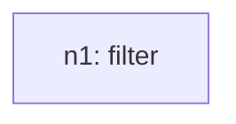
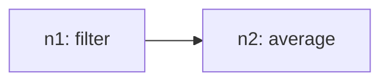

# Recursive Grammar Trace

## Inventory (S(O))
- total_tasks: 2

| taskId | op | sentenceIndex | mention | paramsHint |
| --- | --- | --- | --- | --- |
| o1 | filter | 1 | Filters data from 2015 to 2017 | `{"field": "Year", "operator": "between", "value": ["2015", "2017"]}` |
| o2 | average | 2 | Average the the percentage of responses of Favourable views of U.S from filtered data | `{"field": "Percentage_of_Respondents", "group": "Favorable view of US"}` |

## Steps

### Step 1
- taskId: o1
- nodeId: n1
- op: filter
- groupName: ops
- inputs: []
- scalarRefs: []

#### Inventory delta
- remaining_before_count: 2
- remaining_after_count: 1
- remaining_before: ['o1', 'o2']
- remaining_after: ['o2']

#### Tree snapshot

### Step 2
- taskId: o2
- nodeId: n2
- op: average
- groupName: ops2
- inputs: ['n1']
- scalarRefs: []

#### Inventory delta
- remaining_before_count: 1
- remaining_after_count: 0
- remaining_before: ['o2']
- remaining_after: []

#### Tree snapshot

