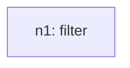
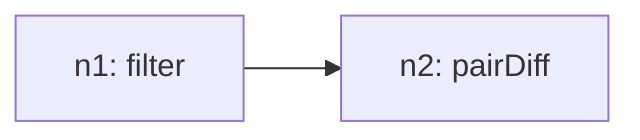
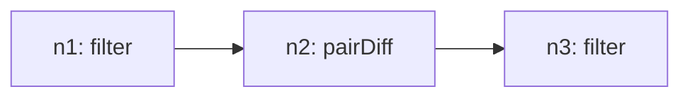
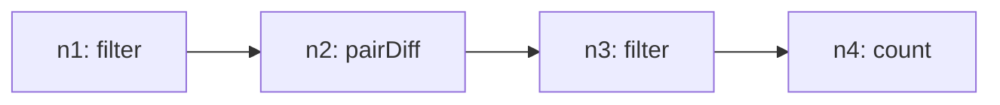

# Recursive Grammar Trace

## Inventory (S(O))
- total_tasks: 4

| taskId | op | sentenceIndex | mention | paramsHint |
| --- | --- | --- | --- | --- |
| o1 | filter | 1 | Filter for the revenue of Thailand and the Philippines | `{"group": ["Thailand", "Philippines"]}` |
| o2 | pairDiff | 2 | Compare the revenue of Thailand and the Philippines | `{"by": "Year", "seriesField": "Country_Region", "field": "Revenue_Million_USD", "groupA": "Thailand", "groupB": "Philippines", "signed": true, "absolute": false}` |
| o3 | filter | 3 | count the years for which Thailand's revenue was higher. | `{"field": "Revenue_Million_USD", "operator": ">", "value": 0}` |
| o4 | count | 3 | count the years for which Thailand's revenue was higher. | `{"field": "Revenue_Million_USD"}` |

## Steps

### Step 1
- taskId: o1
- nodeId: n1
- op: filter
- groupName: ops
- inputs: []
- scalarRefs: []

#### Inventory delta
- remaining_before_count: 4
- remaining_after_count: 3
- remaining_before: ['o1', 'o2', 'o3', 'o4']
- remaining_after: ['o2', 'o3', 'o4']

#### Tree snapshot

### Step 2
- taskId: o2
- nodeId: n2
- op: pairDiff
- groupName: ops2
- inputs: ['n1']
- scalarRefs: []

#### Inventory delta
- remaining_before_count: 3
- remaining_after_count: 2
- remaining_before: ['o2', 'o3', 'o4']
- remaining_after: ['o3', 'o4']

#### Tree snapshot

### Step 3
- taskId: o3
- nodeId: n3
- op: filter
- groupName: ops3
- inputs: ['n2']
- scalarRefs: []

#### Inventory delta
- remaining_before_count: 2
- remaining_after_count: 1
- remaining_before: ['o3', 'o4']
- remaining_after: ['o4']

#### Tree snapshot

### Step 4
- taskId: o4
- nodeId: n4
- op: count
- groupName: ops3
- inputs: ['n3']
- scalarRefs: []

#### Inventory delta
- remaining_before_count: 1
- remaining_after_count: 0
- remaining_before: ['o4']
- remaining_after: []

#### Tree snapshot

