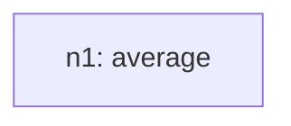

# Recursive Grammar Trace

## Inventory (S(O))
- total_tasks: 2

| taskId | op | sentenceIndex | mention | paramsHint |
| --- | --- | --- | --- | --- |
| o1 | average | 1 | Calculate the average value for all fiscal years | `{"field": "Number of days in thousands"}` |
| o2 | diff | 2 | Get the differences between each year's value and average value | `{"field": "Number of days in thousands", "targetA": "@primary_dimension", "targetB": "ref:n1", "signed": true}` |

## Steps

### Step 1
- taskId: o1
- nodeId: n1
- op: average
- groupName: ops
- inputs: []
- scalarRefs: []

#### Inventory delta
- remaining_before_count: 2
- remaining_after_count: 1
- remaining_before: ['o1', 'o2']
- remaining_after: ['o2']

#### Tree snapshot

