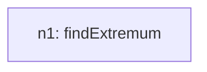
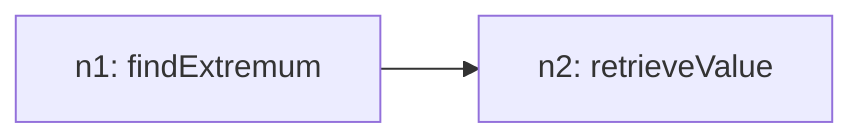
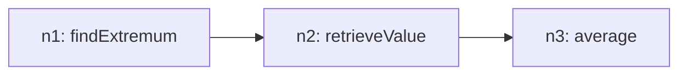

# Recursive Grammar Trace

## Inventory (S(O))
- total_tasks: 3

| taskId | op | sentenceIndex | mention | paramsHint |
| --- | --- | --- | --- | --- |
| o1 | findExtremum | 1 | Check the graph for the data center with the highest value. | `{"field": "Revenue_Million_USD", "group": "Data Centers", "which": "max"}` |
| o2 | retrieveValue | 2 | Check the value for each service area. | `{"field": "Revenue_Million_USD", "target": "ref:n1"}` |
| o3 | average | 3 | Calculate the average. | `{"field": "Revenue_Million_USD"}` |

## Steps

### Step 1
- taskId: o1
- nodeId: n1
- op: findExtremum
- groupName: ops
- inputs: []
- scalarRefs: []

#### Inventory delta
- remaining_before_count: 3
- remaining_after_count: 2
- remaining_before: ['o1', 'o2', 'o3']
- remaining_after: ['o2', 'o3']

#### Tree snapshot

### Step 2
- taskId: o2
- nodeId: n2
- op: retrieveValue
- groupName: ops2
- inputs: ['n1']
- scalarRefs: ['n1']

#### Inventory delta
- remaining_before_count: 2
- remaining_after_count: 1
- remaining_before: ['o2', 'o3']
- remaining_after: ['o3']

#### Tree snapshot

### Step 3
- taskId: o3
- nodeId: n3
- op: average
- groupName: ops3
- inputs: ['n2']
- scalarRefs: []

#### Inventory delta
- remaining_before_count: 1
- remaining_after_count: 0
- remaining_before: ['o3']
- remaining_after: []

#### Tree snapshot

