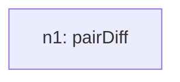
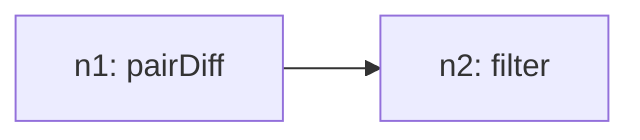

# Recursive Grammar Trace

## Inventory (S(O))
- total_tasks: 3

| taskId | op | sentenceIndex | mention | paramsHint |
| --- | --- | --- | --- | --- |
| o1 | pairDiff | 1 | calculate the difference in 2002 and 2017 | `{"by": "Year", "seriesField": "Opinion", "field": "Percentage", "groupA": "Dissatisfied", "groupB": "Satisfied", "signed": true, "absolute": false}` |
| o2 | filter | 1 | calculate the difference in 2002 and 2017 | `{"field": "Year", "include": ["2002", "2017"]}` |
| o3 | compare | 2 | find the year which has the bigger difference | `{"field": "Percentage", "which": "max"}` |

## Steps

### Step 1
- taskId: o1
- nodeId: n1
- op: pairDiff
- groupName: ops
- inputs: []
- scalarRefs: []

#### Inventory delta
- remaining_before_count: 3
- remaining_after_count: 2
- remaining_before: ['o1', 'o2', 'o3']
- remaining_after: ['o2', 'o3']

#### Tree snapshot

### Step 2
- taskId: o2
- nodeId: n2
- op: filter
- groupName: ops
- inputs: ['n1']
- scalarRefs: []

#### Inventory delta
- remaining_before_count: 2
- remaining_after_count: 1
- remaining_before: ['o2', 'o3']
- remaining_after: ['o3']

#### Tree snapshot

