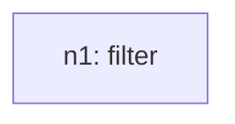
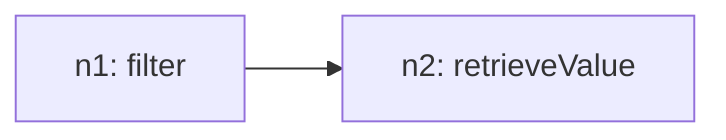

# Recursive Grammar Trace

## Inventory (S(O))
- total_tasks: 3

| taskId | op | sentenceIndex | mention | paramsHint |
| --- | --- | --- | --- | --- |
| o1 | filter | 1 | Check the section with the lowest favorite view of U.S. value (2009, 2010, 2011) | `{"field": "Year", "include": ["2009", "2010", "2011"]}` |
| o2 | retrieveValue | 2 | Check Confidence in U.S. present value corresponding to section 1 | `{"field": "Percentage", "group": "Confidence in US president"}` |
| o3 | sum | 3 | Add all values of number 2 | `{"field": "Percentage", "group": "Confidence in US president"}` |

## Steps

### Step 1
- taskId: o1
- nodeId: n1
- op: filter
- groupName: ops
- inputs: []
- scalarRefs: []

#### Inventory delta
- remaining_before_count: 3
- remaining_after_count: 2
- remaining_before: ['o1', 'o2', 'o3']
- remaining_after: ['o2', 'o3']

#### Tree snapshot

### Step 2
- taskId: o2
- nodeId: n2
- op: retrieveValue
- groupName: ops2
- inputs: ['n1']
- scalarRefs: []

#### Inventory delta
- remaining_before_count: 2
- remaining_after_count: 1
- remaining_before: ['o2', 'o3']
- remaining_after: ['o3']

#### Tree snapshot

