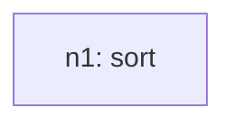
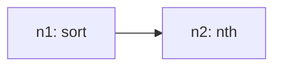

# Recursive Grammar Trace

## Inventory (S(O))
- total_tasks: 2

| taskId | op | sentenceIndex | mention | paramsHint |
| --- | --- | --- | --- | --- |
| o1 | sort | 1 | sort the values from lowest to highest | `{"field": "Average price in US dollars", "order": "asc"}` |
| o2 | nth | 2 | find the second lowest | `{"n": 2, "from": "ref:n1"}` |

## Steps

### Step 1
- taskId: o1
- nodeId: n1
- op: sort
- groupName: ops
- inputs: []
- scalarRefs: []

#### Inventory delta
- remaining_before_count: 2
- remaining_after_count: 1
- remaining_before: ['o1', 'o2']
- remaining_after: ['o2']

#### Tree snapshot

### Step 2
- taskId: o2
- nodeId: n2
- op: nth
- groupName: ops2
- inputs: ['n1']
- scalarRefs: []

#### Inventory delta
- remaining_before_count: 1
- remaining_after_count: 0
- remaining_before: ['o2']
- remaining_after: []

#### Tree snapshot

